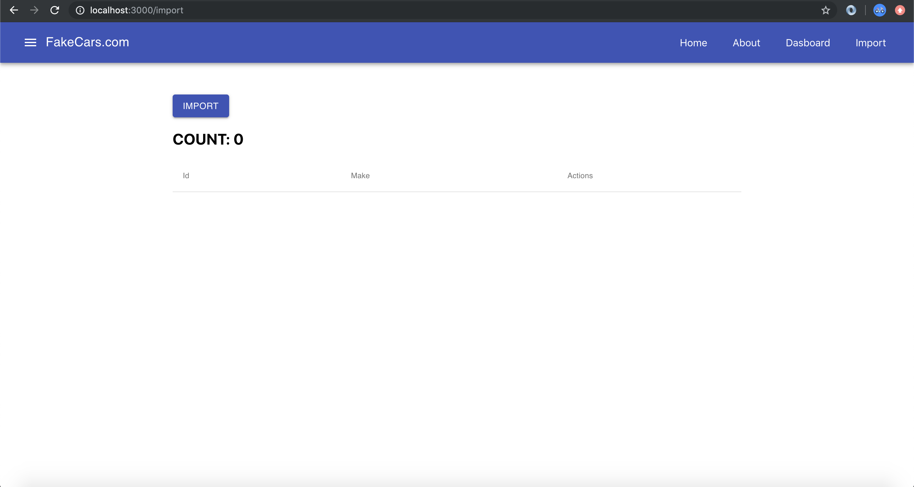
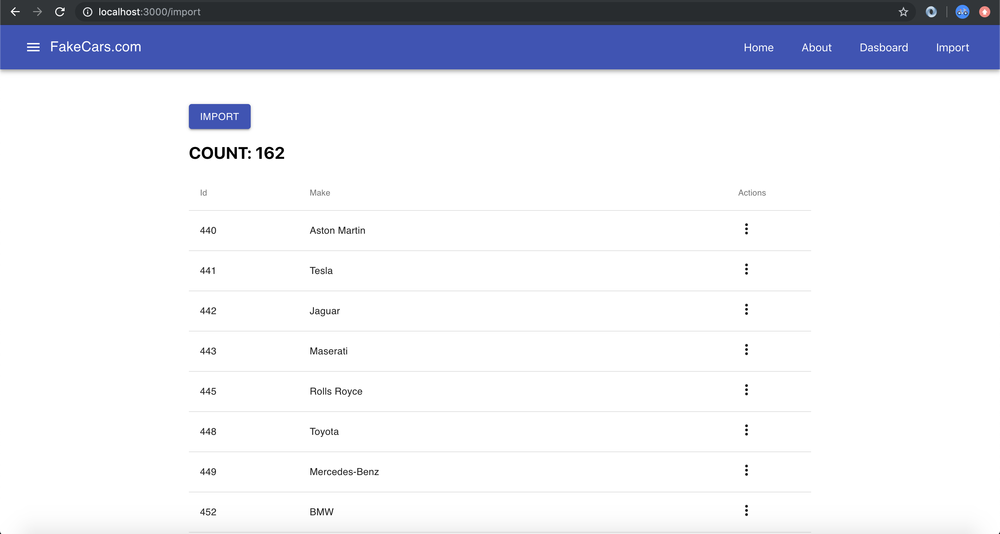
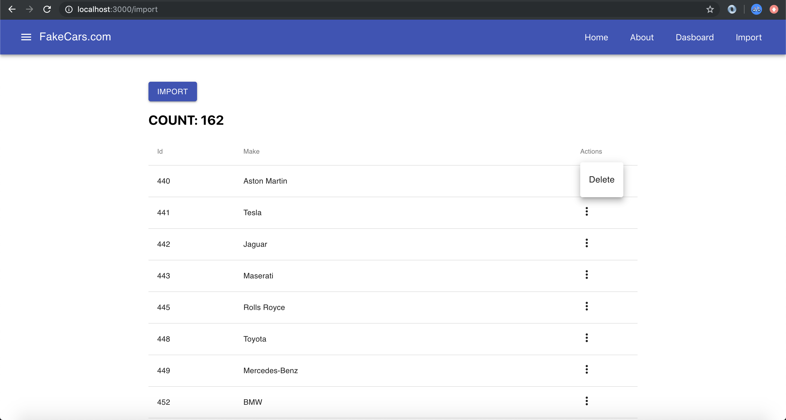

## Setup

Clone this repo and run `npm i` and then `npm start`

## Project Instructions

Today we are going to create a mock-import utility that we can use in our cars application. We will use Redux Thunk to hit an API that brings back cars data. We will then allow the user to delete each import. We also want to keep a current count of the imported cars. Some images below will show what the webpage should look like.

#### Steps

* Navigate to `redux/state.js` and add a property called "makes" at the bottom. It's value will be an empty array "[]". This is going to hold our imported data.

* Next, go to `redux/reducers.js` and add a function call makes. It should have a switch statement in it with one case. That case will be called "FETCH_MAKES" and we will return `action.value` if it's hit. As usual, handle the default case and simply `return state`.

* Of course, we will need an action to support this but first let's update the store to handle redux thunk.. since our action will be asynchronous. To do that, go to `redux/store.js` and import "applyMiddleware" in the appropriate spot. Google it if you don't know where it goes. Also, import `thunk` from "redux-thunk". Finally, add `applyMiddleware(thunk)` as the last agrument to the `createStore` function.

* Now it's time to create our action. Remember this action is asynchronous, which is why we need thunk. As a reminder, asynchronus means that this bit of code could take an indeterminate amount of time to run because it relies out outside systems (an API on another server). We always handle these types of functions differently in JavaScript.

* Go to `redux/actions.js` and create a function called `fetchMakes`. This function will not take any arguments. Inside of the function you need to make a "fetch" to the url defined at the top of the actions.js file. After the fetch call returns (remember how promises work), dispatch an action with a type = "FETCH_MAKES" and a value of "response.Results" (response is whatever you called it in the the "then" promise chain). Note, if you copy/paste the url from actions into your browser you will see the data and the properties available.

* Now that we have Redux configured for this action it's time to build out the component. Notice that there is an `Import.js` file underneath the "components" and "containers" folders. In fact, it's also already been tied into the router for you so if you navigate to "/import" you should see a line of text.

* On this page you need to use `material-ui` to create a button and a table. Let's do that part first. Import Button, Table, TableHead, TableBody, TableRow and TableCell from "material-ui/core". You may also want to import "Container" to help with styling. Remember to look at the Material UI docs if you don't understand how this works. 

* Create a button with the text "Import". Make it's variant contained and it's color primary. Then create a table underneath it. The table should have three columns (Id, Make, Actions).

* For the TableBody we are going to want to `map` through our list of "makes" (from Redux) to display all the rows. To do that we first need to hook up our `mapStateToProps` function so that our Import component can read the data. Go to `containers/Import.js` and go through the normal setup for this step. As a reminder, that involves importing "connect", import the "Import" component and then creating a mapStateToProps function that maps the property "makes" to "state.makes".

* Once that is done go to the `Router` file and switch the import so that it references "containers/Import" instead of "components/Import".

* Now we can go back to the "Import" component and write our map function. Inside of the `<TableBody>` tags we need to write `{ props.makes.map()... }`. You should know that part by now. Return a `TableRow` with three `TableCell`s in it. Reference the data from the API to see what you should put where. For example, each make has a "MakeId" and a "MakeName" so you will be using those to correspond to the Id and Make columns. Leave the actions column alone for now.

* We've got the setup in our component and we just need to tie the import button in so that it makes the fetch call when it's clicked. First we need to add `mapDispatchToProps` in our container. Let's navigate to the "Import" container and do that now. Map a property called "fetchMakes" to `() => dispatch(fetchMakes())` and remember to import the "fetchMakes" action at the top of the file.

* Now let's go to the Button in our Import component and add an "onClick" method. All it has to do is reference the "fetchMakes" prop. For example, `onClick={props.fetchMakes}`.

* It's time for the moment of truth. Click the button. It should take a second and then populate your table with a list of "makes". If it didn't, check with someone near your or ask the instructor during class. Before you do that though, spend a few minutes debugging to see if you can find out where the issue is.

* If the table is being populate it's time for us to move onto the next step which is adding our actions. We are going to have a dropdown menu on under the actions column that allows us to "delete" that particular row. We are going to refence [menus](https://material-ui.com/components/menus/) from Material UI to do this. 

* First `import { MoreVert } from '@material-ui/icons'` for the button and place the <MoreVert> component under the actions column. In the table. We are going to expand our menu using it's onClick method. Reference the code from the link above to figure out how to open/close the menu. Hint: Put the code for `<Menu>` outside of the table.

* Now that the menu is working we need to create the action to delete a certain row. Make a new action called `deleteMake`. It will take accept one argument that represents the index we want to delete. We've deleted rows from tables before so look back at previous homework assignments to write an appropriate action and reducer that handles this use case. Remember to also add your new action to the `mapDispatchToProps` function in your container.

* You will probably need to use local state to pass the index you want to delete to your menu. This is another challenge we'd like to you try out on your own before asking for help. 

* Once all the above is done, create a simple `<h2>` that displays `COUNT: <NUM>` where NUM is `props.makes.length`. We want to always know how many rows we have.

* Finally, add a "Import" button to the navigation bar so that we don't have to type "/import" in the browser bar each time.

## Examples

